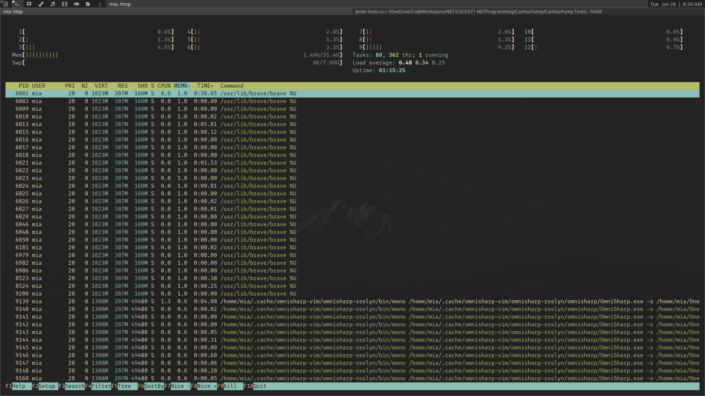

tabbed - generic tabbed interface
=================================
tabbed is a simple tabbed X window container.

Screenshot
------------

Applied Patches
---------------
- [Alpha](./patches/alpha.diff)

Requirements
------------
In order to build tabbed you need the Xlib header files.

- **Fonts** - [Noto Sans Nerd Font Regular](https://github.com/ryanoasis/nerd-fonts/blob/master/patched-fonts/Noto/Sans/complete/Noto%20Sans%20Regular%20Nerd%20Font%20Complete.ttf)

Installation
------------
Edit config.mk to match your local setup (tabbed is installed into
the /usr/local namespace by default).

Afterwards enter the following command to build and install tabbed
(if necessary as root):

    make clean install

Running tabbed
--------------
See the man page for details.

